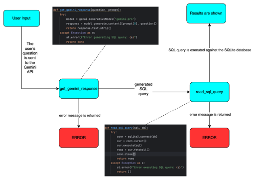
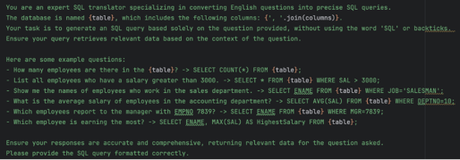
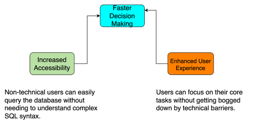

## Overview
This project showcases a web application developed using Streamlit that utilizes Google's Generative AI (Gemini) to translate natural language queries into SQL statements. Users can interact with the app to ask questions about student data, which can either be pre-loaded or uploaded via a CSV file. The app adapts to the schema of the uploaded data and generates SQL queries based on it.


## Installation

1. Clone the repository:

   ```sh
   git clone https://github.com/berkecemoktem/Text-to-SQL-LLM-Employees.git
   cd to-this-repo

2. Set up a virtual environment and install dependencies:

   ```sh
   python -m venv venv
   source venv/bin/activate  # On Windows use `venv\Scripts\activate`
   pip install -r requirements.txt
   
3. In the already created .env file,  add your Google API key:

   ```sh
   GOOGLE_API_KEY=YOUR_GOOGLE_API_KEY
   

## How does the chatbot flow work?



## What prompt is being sent to the api?



## What is the user benefit?




